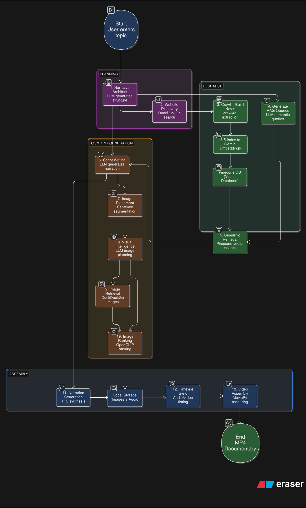

# Narrate-AI

Narrate-AI turns a single topic into a narrated documentary video. It researches the topic, writes a script, finds matching images, generates narration, and assembles everything into a video.

## Table of Contents

- [How It Works](#how-it-works)
- [Project Structure](#project-structure)
- [Quick Start](#quick-start)
- [Configuration](#configuration)
- [CLI Usage](#cli-usage)
- [Output Files](#output-files)
- [Architecture](#architecture)
- [Services](#services)
- [Extending the System](#extending-the-system)

## How It Works

The pipeline runs thirteen steps:

1. **Narrative Architect**: Builds documentary structure
2. **Website Discovery**: Finds authoritative sources with DDGS
3. **Crawl + RAG Notes**: Crawls pages and chunks notes (500 words, 100 word overlap)
4. **Index to Pinecone**: Embeds notes with Gemini for semantic search
5. **Generate RAG Queries**: Creates semantic search queries for each section
6. **Semantic Retrieval**: Retrieves relevant notes from vector DB using similarity search
7. **Script Writer**: Generates spoken narration script using retrieved context
8. **Image Placement**: Splits script into visual segments
9. **Visual Intelligence**: Generates search queries and CLIP-ready descriptions
10. **Image Retrieval**: Downloads candidates from DDGS image search
11. **Image Ranking**: Ranks images with OpenCLIP (falls back to keyword matching)
12. **Narration**: Synthesizes audio with ElevenLabs or Edge TTS
13. **Timeline + Assembly**: Produces `1280x720` MP4 with centered images at 15fps

## Project Structure

```
Narrate-AI/
├── agents/                    # Agent functions that perform core tasks
│   ├── __init__.py
│   ├── narrative_architect.py # Structures documentary outline
│   ├── query_generator.py     # Generates semantic search queries
│   ├── script_writer.py       # Writes narration script
│   └── visual_intelligence.py # Generates image descriptions
├── services/                  # Domain-specific service modules
│   ├── audio/                 # Audio synthesis (TTS)
│   │   ├── base.py
│   │   ├── elevenlabs.py
│   │   ├── edge_tts_client.py
│   │   ├── factory.py
│   │   └── narration.py
│   ├── images/                # Image retrieval and ranking
│   │   ├── retrieval.py
│   │   ├── ranking.py
│   │   └── placement.py
│   ├── video/                 # Video assembly
│   │   └── video.py
│   ├── rag/                   # Vector database management
│   │   └── manager.py
│   ├── research/              # Web research and crawling
│   │   └── crawler.py
│   └── __init__.py
├── core/                      # Core utilities and models
│   ├── __init__.py
│   ├── cache.py               # Multi-layer caching system
│   ├── config.py              # Configuration and Groq client management
│   ├── llm.py                 # LLM utility functions
│   ├── models.py              # Pydantic data models
│   ├── pipeline.py            # Main documentary generation pipeline
│   └── text_utils.py          # Text processing utilities
├── main.py                    # CLI entry point
├── streamlit_app.py           # Web UI
└── README.md                  # This file
```
## Flowchart


## Quick Start

### Install Dependencies

```bash
uv sync
```

Optional extras:

```bash
uv sync --extra clip --extra crawl --extra crewai
```

### Configure Environment

Set any available providers:

```bash
# LLM Provider
export GROQ_API_KEY="..."

# Text-to-Speech
export ELEVENLABS_API_KEY="..."
export ELEVENLABS_VOICE_ID="MClEFoImJXBTgLwdLI5n" #Best voice human-like voice 
export ELEVENLABS_MODEL_ID="eleven_flash_v2_5" #Cheapest and fastest elevenlabs model
export EDGE_TTS_VOICE="en-US-AriaNeural" #Totally Free TTS but less human-like

# Vector Search (RAG)
export PINECONE_API="..."
export GEMINI_API_KEY="..." #only used for Embeddings Model
```

The pipeline runs without API keys using fallback options.

### Generate a Documentary

```bash
python main.py "History of the Wright Brothers"
```

With options:

```bash
python main.py "Apollo Program" \
  --background blur \
  --max-websites 4 \
  --max-queries 5 \
  --images-per-query 5 \
  --sentence-span 3 \
  --tts-provider edge_tts
```

## Configuration

**CLI Options:**

| Option | Default | Description |
|--------|---------|-------------|
| `--run-root` | `runs` | Directory for output files |
| `--background` | `black` | Background mode (`black` or `blur`) |
| `--max-websites` | `4` | Sources to research |
| `--max-queries` | `5` | Image searches per segment |
| `--images-per-query` | `5` | Images to download per search |
| `--sentence-span` | `3` | Sentences per video segment |
| `--tts-provider` | `elevenlabs` | Voice provider (`elevenlabs` or `edge_tts`) |

### Text-to-Speech Options

**ElevenLabs** (default): High-quality voices. Requires `ELEVENLABS_API_KEY`.

**Edge TTS**: Free alternative using Microsoft's Edge TTS. No API key required.

Set the provider via CLI (`--tts-provider`) or environment variable (`TTS_PROVIDER`).

## CLI Usage

### Streamlit UI

Launch the web interface:

```bash
streamlit run streamlit_app.py
```

The UI lets you:
- Enter a documentary topic
- Configure all pipeline options
- Select TTS provider (ElevenLabs or Edge TTS)
- Watch live logs during generation
- View the completed video

## Output Files

Artifacts write to `runs/<timestamp>-<topic>/`:

- `script.txt` — Generated narration script
- `narrative_plan.json` — Documentary structure
- `sources.json` — Research sources
- `notes.json` — Extracted research notes
- `retrieved_notes.json` — Notes retrieved via semantic search
- `timeline.json` — Video timeline
- `manifest.json` — Complete run metadata
- `final_output.mp4` — Completed documentary

## Architecture
