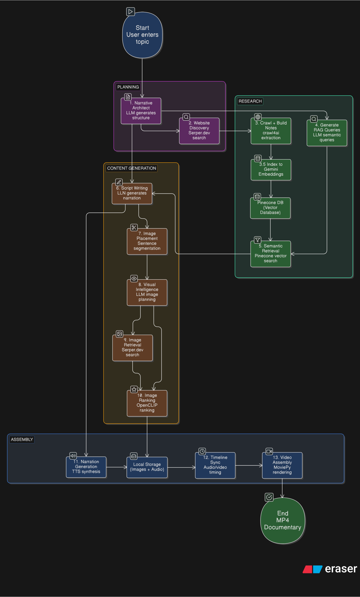

# Narrate-AI

Narrate-AI turns a single topic into a narrated documentary video. It researches the topic, writes a script, finds matching images, generates narration, and assembles everything into a video.

## Table of Contents

- [How It Works](#how-it-works)
- [Project Structure](#project-structure)
- [Quick Start](#quick-start)
- [Configuration](#configuration)
- [CLI Usage](#cli-usage)
- [Output Files](#output-files)
- [Architecture](#architecture)
- [Services](#services)
- [Extending the System](#extending-the-system)

## How It Works

The pipeline runs in four phases: Research, Generation, Retrieval, and Production.

### Phase 1: Research & Context Building

1. **Narrative Architect** — Analyzes the topic using an LLM to create a structured documentary outline. It determines key themes, identifies 3-5 main sections, and establishes the narrative arc—deciding what story needs to be told and in what order.

2. **Website Discovery** — Uses DuckDuckGo Search to find authoritative sources on the topic. It prioritizes reliable sources like news articles, academic papers, and established publications. The system collects URLs that will provide factual foundation for the documentary.

3. **Crawl + RAG Notes** — Crawls each discovered website and extracts the main content. The extracted text is then chunked into 500-word segments with 100-word overlap between chunks to preserve context at segment boundaries. These chunks become the knowledge base for the documentary.

4. **Index to Pinecone** — Converts all text chunks into vector embeddings using Gemini's embedding model. These embeddings are stored in Pinecone, a vector database that enables semantic similarity search—finding content based on meaning rather than exact keyword matches.

5. **Generate RAG Queries** — For each section of the documentary outline, the system uses an LLM to generate 3-5 semantic search queries. These queries are designed to retrieve the most relevant information from the vector database for that specific section.

6. **Semantic Retrieval** — Searches Pinecone using the generated queries and performs similarity search to retrieve the most relevant text chunks for each section. This gives the script writer rich, context-aware information to work with.

### Phase 2: Content Generation

7. **Script Writer** — Uses the retrieved context combined with the LLM to generate a spoken narration script. The script is written in a documentary style—informative, engaging, and suitable for audio narration. It pulls factual details from the research while maintaining a cohesive narrative voice.

8. **Image Placement** — Analyzes the script and splits it into visual segments. It determines natural break points where images can change (typically every 3 sentences) and assigns each segment a specific time duration based on word count and average speaking pace.

9. **Visual Intelligence** — For each visual segment, generates optimized search queries and CLIP-ready descriptions. The system creates multiple search approaches (keywords, phrases, descriptive text) and generates natural language descriptions of what the ideal image should contain.

### Phase 3: Image Retrieval

10. **Image Retrieval** — Uses DuckDuckGo image search to download candidate images for each segment. It searches using multiple queries per segment (default 5 queries with 5 images each) to ensure a diverse pool of candidates.

11. **Image Ranking** — Evaluates all downloaded candidates using OpenCLIP (a vision-language model). It compares each image against the segment's CLIP descriptions and ranks them by relevance score. Falls back to keyword matching if OpenCLIP fails.

### Phase 4: Production

12. **Narration** — Synthesizes the audio narration from the script. Uses ElevenLabs for high-quality, human-like voices (requires API key) or Edge TTS as a free alternative. The audio is generated to match the timing of the visual segments.

13. **Timeline + Assembly** — Combines all elements into the final video. Images are centered in a 1280x720 frame, the narration audio is synchronized with segment transitions, and everything is rendered at 15fps into a final MP4 file.

### Output Files

Artifacts write to `runs/<timestamp>-<topic>/`:

- `script.txt` — Generated narration script
- `narrative_plan.json` — Documentary structure
- `sources.json` — Research sources
- `notes.json` — Extracted research notes
- `retrieved_notes.json` — Notes retrieved via semantic search
- `timeline.json` — Video timeline
- `manifest.json` — Complete run metadata
- `final_output.mp4` — Completed documentary

## Flowchart


## Project Structure

```
Narrate-AI/
├── agents/                    # Agent functions that perform core tasks
│   ├── __init__.py
│   ├── narrative_architect.py # Structures documentary outline
│   ├── query_generator.py     # Generates semantic search queries
│   ├── script_writer.py       # Writes narration script
│   └── visual_intelligence.py # Generates image descriptions
├── services/                  # Domain-specific service modules
│   ├── __init__.py
│   ├── audio/                 # Audio synthesis (TTS)
│   │   ├── base.py
│   │   ├── elevenlabs.py
│   │   ├── edge_tts_client.py
│   │   ├── factory.py
│   │   └── narration.py
│   ├── images/                # Image retrieval and ranking
│   │   ├── retrieval.py
│   │   ├── ranking.py
│   │   └── placement.py
│   ├── video/                 # Video assembly
│   │   └── video.py
│   ├── rag/                   # Vector database management
│   │   └── manager.py
│   ├── research/              # Web research and crawling
│   │   └── crawler.py
├── core/                      # Core utilities and models
│   ├── __init__.py
│   ├── cache.py               # Multi-layer caching system
│   ├── config.py              # Configuration and Groq client management
│   ├── llm.py                 # LLM utility functions
│   ├── models.py              # Pydantic data models
│   ├── pipeline.py            # Main documentary generation pipeline
│   └── text_utils.py          # Text processing utilities
├── main.py                    # CLI entry point
├── streamlit_app.py           # Web UI
└── README.md                  # This file
```

## How to Run

### Install Dependencies

```bash
uv sync
```

### Environment Variables

Copy the example environment file and add your API keys:

```bash
cp .env.example .env
```

Then edit `.env` and fill in your API keys. The pipeline runs without API keys using fallback options.
- **LLM**: `GROQ_API_KEY` (recommended for script generation)
- **Text-to-Speech**: `ELEVENLABS_API_KEY` for premium voices, or use free `EDGE_TTS_VOICE`
- **Vector Search**: `PINECONE_API` and `GEMINI_API_KEY` for RAG embeddings

### Streamlit UI

Launch the web interface:

```bash
uv run streamlit run streamlit_app.py
```

The UI lets you:
- Enter a documentary topic
- Configure all pipeline options
- Select TTS provider (ElevenLabs or Edge TTS)
- Watch live logs during generation
- View the completed video

### Configurations

**Options:** 

| Option | Default | Description |
|--------|---------|-------------|
| `--run-root` | `runs` | Directory for output files |
| `--background` | `black` | Background mode (`black` or `blur`) |
| `--max-websites` | `4` | Sources to research |
| `--max-queries` | `5` | Image searches per segment |
| `--images-per-query` | `5` | Images to download per search |
| `--sentence-span` | `3` | Sentences per video segment |
| `--tts-provider` | `elevenlabs` | Voice provider (`elevenlabs` or `edge_tts`) |

### Text-to-Speech Options

**ElevenLabs** (default): High-quality voices. Requires `ELEVENLABS_API_KEY`.

**Edge TTS**: Free alternative using Microsoft's Edge TTS. No API key required.

Set the provider via CLI (`--tts-provider`) or environment variable (`TTS_PROVIDER`).
